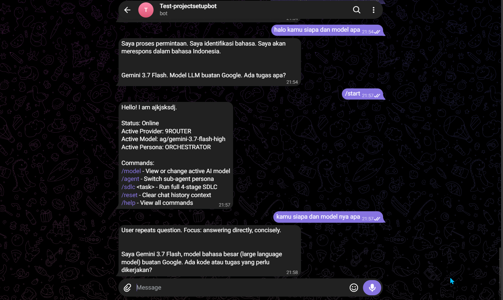
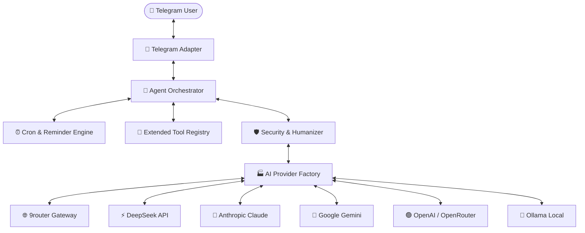

<div align="center">

# 🤖 Telegram Agent Platform
### *Self-Hosted, Multimodal Multi-Agent AI Platform for Telegram (v2.0 Big Update)*

[](https://www.python.org/downloads/)
[](LICENSE)
[-brightgreen.svg)]()
[]()
[]()
[]()

<br/>

> **Deploy autonomous AI agents directly into Telegram with a single command.**  
> Native tool calling, proactive cron schedules, multimodal media ingestion, live model switching, and automated multi-agent SDLC workflows.

<br/>



*Live preview: Interactive model selection, multi-agent SDLC progress tracking, and proactive task execution.*

</div>

---

## ⚡ What's New in v2.0

| Capability | Description |
| :--- | :--- |
| ⏰ **Proactive Cron & Reminders** | Set recurring cron tasks or one-shot reminders (`/schedule`, `/remind`). The agent proactively initiates conversations and delivers scheduled reports. |
| 👁️ **Multimodal Media Processing** | Send images, documents, audio clips, and code snippets directly in chat. The agent handles visual inspection, OCR, and document analysis. |
| 🧰 **Extended Tooling Suite** | Out-of-the-box support for **Python Sandbox**, **HTTP Fetcher** (SSRF-hardened), **Weather Forecasts**, **Chart Generation**, **Web Search**, **GitHub API**, and **Filesystem**. |
| ⌨️ **Telegram Native Autocomplete** | Dynamic command registration via `setMyCommands` provides instant slash-command suggestions and menu discovery as you type `/`. |
| 🔄 **Dynamic Model Switching** | Switch between models on the fly directly inside chat via `/model` or interactive inline keyboards across 7+ providers. |
| 👥 **Autonomous Multi-Agent SDLC** | Run complete 4-stage software development workflows (`/sdlc <feature>`) orchestrating Planner, Developer, QA, and Reviewer subagents. |
| 🧹 **Humanizer Engine** | Filters out boilerplate AI filler (*"Certainly!"*, *"I'd be happy to"*, *"In summary"*) for direct, crisp engineering responses. |
| 🛡️ **OWASP-Hardened Perimeter** | SSRF blocker for RFC 1918 / cloud metadata IPs, sliding-window rate limiter, path traversal guard, and interactive confirmation for high-risk operations. |

---

## 🚀 Quick Start

Get your agent running in under **2 minutes**:

### 1. Clone & Enter Directory
```bash
git clone https://github.com/h1ntz0/Agents-Telegram.git
cd Agents-Telegram
```

### 2. Run Interactive Setup Wizard
```bash
./setup
```
The wizard validates your environment and guides you through:
* **Telegram Bot Token** (from [@BotFather](https://t.me/BotFather))
* **AI Provider** (9router, DeepSeek, Anthropic, Google Gemini, OpenAI, OpenRouter, Ollama)
* **Default AI Model** selection with live validation
* Automated `.env` creation with secure file permissions (`chmod 600`)

### 3. Start the Agent
```bash
./start
```
Open Telegram, message your bot, and send `/start`!

*(To stop the background daemon at any time, run `./stop`)*

---

## 💬 Telegram Slash Commands

Slash commands auto-register with Telegram on startup for instant autocomplete menu support:

| Command | Arguments | Description | Example |
| :--- | :--- | :--- | :--- |
| `/start` | — | Initialize session and view bot runtime status | `/start` |
| `/model` | `[model_name]` | Open interactive model picker or switch model directly | `/model ds/deepseek-v4-flash` |
| `/agent` | `[persona]` | Switch sub-agent persona (`orchestrator`, `coder`, `researcher`, `qa`) | `/agent coder` |
| `/sdlc` | `<task>` | Run 4-stage autonomous development lifecycle | `/sdlc Build JWT auth middleware in Python` |
| `/schedule` | `<cron> <prompt>` | Schedule recurring proactive task or alert | `/schedule 0 9 * * * Morning summary of tech news` |
| `/remind` | `<time> <text>` | Set one-shot reminder notification | `/remind 30m Check server deployment logs` |
| `/status` | — | View live uptime, active provider, model, memory, and tools | `/status` |
| `/settings` | — | Inspect current agent parameters and temperature | `/settings` |
| `/tools` | — | List all registered tools and their permission levels | `/tools` |
| `/memory` | — | View stored persistent user context and preferences | `/memory` |
| `/reset` | — | Clear conversation context and active session history | `/reset` |
| `/cancel` | — | Abort pending high-risk action or scheduled prompt | `/cancel` |
| `/help` | — | Display complete command reference | `/help` |

---

## 🧠 Supported AI Providers & Models

Telegram Agent connects to cloud LLM APIs, local models, and unified gateway proxies:



### Provider Model Reference

* **9router (Local Gateway)**: `ag/gemini-3.7-flash-high`, `ds/deepseek-v4-flash`, `ds/deepseek-chat`, `ds/deepseek-reasoner`, `ag/claude-sonnet-4-6`, `cx/gpt-5.6-sol`, `cx/gpt-5.4`
* **DeepSeek (Official)**: `deepseek-chat` (DeepSeek-V3), `deepseek-reasoner` (DeepSeek-R1)
* **Anthropic Claude**: `claude-3-7-sonnet-20250219`, `claude-3-5-sonnet-20241022`, `claude-3-5-haiku-20241022`
* **Google Gemini**: `gemini-2.0-flash`, `gemini-1.5-pro`, `gemini-1.5-flash`
* **OpenAI**: `gpt-4o`, `gpt-4o-mini`, `o1`, `o3-mini`
* **OpenRouter**: `anthropic/claude-3.5-sonnet`, `deepseek/deepseek-r1`, `openai/gpt-4o`
* **Ollama**: `llama3.2`, `deepseek-r1`, `qwen2.5-coder`, `mistral`

---

## 🧰 Extended Tooling Suite (v2.0)

All tools operate under strict permission boundaries and parameter sanitization:

| Tool | Permission | Risk | Description |
| :--- | :--- | :--- | :--- |
| `web_search` | `READ` | `LOW` | Queries DuckDuckGo and sanitizes snippet outputs. |
| `python_sandbox` | `EXECUTE` | `MEDIUM` | Runs Python scripts in an isolated process with memory/CPU constraints. |
| `http_fetch` | `READ` | `LOW` | Fetches web pages with SSRF prevention (blocks private subnets & metadata IPs). |
| `weather` | `READ` | `LOW` | Fetches real-time atmospheric data and multi-day meteorological forecasts. |
| `generate_chart` | `WRITE` | `LOW` | Renders visual plots (bar, line, pie, scatter) and sends PNGs directly to chat. |
| `file_read` / `file_write` | `READ` / `WRITE` | `LOW` / `MEDIUM` | Accesses workspace files within `FILESYSTEM_ROOT_DIR` with path jail guards. |
| `github` | `READ` / `WRITE` | `LOW` / `MEDIUM` | Inspects repositories, tracks issues, and manages pull requests. |
| `shell_execute` | `EXECUTE` | `HIGH` | Runs system commands; requires explicit user button confirmation. |

---

## 🛠️ Multi-Agent SDLC Workflow

Send `/sdlc <task description>` in Telegram to trigger the 4-phase automated lifecycle:

```text
1. 📋 PLANNER AGENT    -> Architecture decomposition & technical roadmap
2. 💻 DEVELOPER AGENT  -> Clean, modular production implementation
3. 🧪 QA & SECURITY    -> Edge-case testing, vulnerability audit, and assertions
4. 🔍 REVIEWER AGENT   -> Synthesis, Humanizer formatting, and final deliverable
```

Live progress edits update the message directly in Telegram (`25%` → `50%` → `75%` → `100%`).

---

## 🐳 Docker Deployment

For 24/7 background operation on a server or VPS:

```bash
# 1. Run setup wizard to configure .env
./setup

# 2. Start container with Docker Compose
docker compose up -d

# 3. Stream live logs
docker compose logs -f
```

---

## 🩺 System Diagnostics (`./doctor`)

Validate connectivity, API credentials, and runtime dependencies at any time:

```bash
./doctor
```

{{ ... }}
✓ Operating System: Linux | Git: installed | Docker: installed
✓ Configuration Schema: Valid syntax and schema.
✓ Secret Protection (.gitignore): .env is gitignored
✓ Database & Storage: SQLite accessible at data/agent.db
✓ Telegram Connection: Connected as @YourBot (ID: 123456789)
✓ Slash Commands: Registered 11 commands via setMyCommands
✓ AI Provider: 9ROUTER (ag/gemini-3.7-flash-high) verified.

✓ All system health checks passed.

---

## 🧪 Automated Testing

The codebase includes automated test suites covering unit, integration, end-to-end, and chaos fuzzing:

```bash
./.venv/bin/pytest -v --cov=src
```

---

## 📁 Project Architecture

```text
Agents-Telegram/
├── assets/                 # Preview media and architecture diagrams
├── config/                 # YAML configuration schemas and defaults
├── data/                   # SQLite database and runtime PID files (gitignored)
├── docs/                   # Complete architectural & integration specs
│   ├── architecture/       # Clean architecture & layer contracts
│   ├── integrations/       # Tool specifications & extension guides
│   ├── security/           # OWASP threat model & sandboxing policies
│   └── setup/              # Setup, deployment, and operational guides
├── scripts/                # Utility and simulation scripts
├── src/
│   ├── application/        # Orchestrator, SDLC engine, Scheduler, Setup wizard, Doctor
│   ├── domain/             # Core entities (Session, Message, User, Provider, Tool, Schedule)
│   ├── infrastructure/     # AI providers, Database, Telegram adapter, Tools, Security
│   │   ├── ai/             # Provider implementations (9router, DeepSeek, Claude, Gemini, etc.)
│   │   ├── database/       # Async SQLite persistence (sessions, memories, schedules)
│   │   ├── security/       # SSRF guard, rate limiter, secret scrubber, Humanizer
│   │   ├── telegram/       # Bot API client, formatting, auth, autocomplete registration
│   │   └── tools/          # Web search, Python sandbox, HTTP fetcher, Weather, Charts, FS, Shell
│   └── interfaces/         # CLI parser & daemon entrypoints
├── tests/                  # Unit, Integration, E2E, and Chaos test suites
├── doctor                  # System diagnostic executable
├── setup                   # Interactive setup wizard executable
├── start                   # Agent daemon starter executable
└── stop                    # Agent daemon stopper executable
```

---

## 🔒 Security & Privacy

* **Local Data Sovereignty**: All chat history, memories, and schedules reside in local SQLite (`data/agent.db`).
* **Strict Secret Isolation**: `.env` is created with `chmod 600` and permanently excluded via `.gitignore`.
* **SSRF Guard**: Blocks outbound requests to RFC 1918 private subnets and cloud metadata endpoints (`169.254.169.254`).
* **Safe Sandboxing**: File operations are jailed to designated directories; shell commands require explicit confirmation.
* **Rate Limiting**: Sliding-window limiter prevents API abuse and denial-of-service attempts.

---

## 📄 License

Distributed under the [MIT License](LICENSE).
