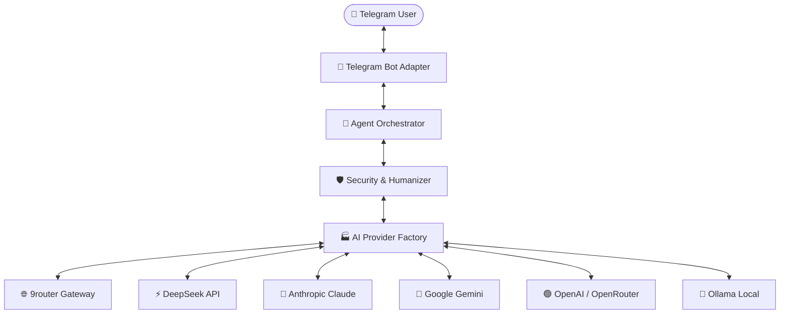

<div align="center">

# 🤖 Telegram Agent Platform
### *Zero-Friction, Self-Hosted Multi-Agent AI Platform for Telegram*

[](https://www.python.org/downloads/)
[](LICENSE)
[-brightgreen.svg)]()
[]()
[]()

<br/>

> **Run powerful AI agents directly in Telegram with a single command setup.**  
> Built for developers, teams, and enthusiasts who want full control over their AI infrastructure without the complexity.

<br/>


*Preview: Live bot interaction featuring dynamic model switching, Multi-Agent SDLC, and humanized responses.*

</div>

---

## ✨ Key Highlights

| Feature | Description |
| :--- | :--- |
| ⚡ **Zero-Friction Wizard** | Clone and run `./setup`. Interactive terminal wizard validates tokens & credentials in real-time. |
| 🌐 **Universal AI Providers** | First-class support for **9router**, **DeepSeek**, **Claude (Anthropic)**, **Google Gemini**, **OpenAI**, **OpenRouter**, and **Ollama**. |
| 🔄 **Live Model Switching** | Switch between models on the fly directly inside Telegram chat using `/model` or interactive inline buttons. |
| 👥 **Autonomous Multi-Agent SDLC** | Execute complete software development lifecycles (`/sdlc <feature>`) orchestrating **Planner**, **Developer**, **QA Tester**, and **Reviewer** subagents with live progress bars. |
| 🎭 **Dynamic Subagent Personas** | Switch agent behavior on demand (`/agent coder`, `/agent researcher`, `/agent qa`, `/agent orchestrator`). |
| 🧹 **Humanizer Engine** | Eliminates robotic AI cliches (*"Certainly!"*, *"Let's delve into"*, *"In Conclusion"*) for crisp, authentic human-style responses. |
| 🛡️ **Enterprise-Grade Security** | SSRF protection, sliding-window rate limiting, path traversal guards, regex secret masking, and interactive confirmation for high-risk actions. |
| 💾 **Persistent SQLite Memory** | Remembers user context and settings per-user with full session isolation. |
| ⌨️ **Telegram Native Autocomplete** | Slash commands automatically register with Telegram (`setMyCommands`) for instant autocomplete suggestions when typing `/`. |

---

## 🚀 Quick Start (3 Steps)

Get your private AI agent running on Telegram in less than **2 minutes**:

### 1. Clone & Enter Directory
```bash
git clone https://github.com/h1ntz0/Agents-Telegram.git
cd Agents-Telegram
```

### 2. Run Interactive Setup Wizard
```bash
./setup
```
The wizard will automatically check your Python environment and guide you through configuration:
* Paste your **Telegram Bot Token** (from [@BotFather](https://t.me/BotFather))
* Choose your **AI Provider** (9router, DeepSeek, Anthropic, Google, OpenAI, etc.)
* Select your preferred **AI Model** from the menu or type custom model names
* Review and save to `.env` (automatically secured with `chmod 600`)

### 3. Start the Agent
```bash
./start
```
Open Telegram, search for your bot, and send `/start`!

*(To stop the background agent anytime, simply run `./stop`)*

---

## 💬 Telegram Slash Commands

| Command | Action | Example |
| :--- | :--- | :--- |
| `/start` | Start conversation & display bot runtime status | `/start` |
| `/model` | Open interactive model picker or change model directly | `/model ds/deepseek-v4-flash` |
| `/agent` | Switch sub-agent persona | `/agent coder` |
| `/sdlc` | Run 4-stage autonomous SDLC pipeline | `/sdlc Build JWT auth middleware in Python` |
| `/status` | View live uptime, active provider, model, & tools | `/status` |
| `/settings` | Inspect current agent parameters & temperature | `/settings` |
| `/tools` | List all registered and active tools | `/tools` |
| `/memory` | View stored key-value memory context | `/memory` |
| `/reset` | Clear chat history & conversation context | `/reset` |
| `/cancel` | Cancel any pending high-risk tool action | `/cancel` |
| `/help` | Display command cheatsheet & usage guide | `/help` |

---

## 🧠 Supported AI Providers & Models

Telegram Agent supports any OpenAI-compatible gateway as well as official SDK endpoints:



### Provider Model Matrix

* **9router (Local Gateway)**: `ag/gemini-3.7-flash-high`, `ds/deepseek-v4-flash`, `ds/deepseek-chat`, `ds/deepseek-reasoner`, `ag/claude-sonnet-4-6`, `cx/gpt-5.6-sol`, `cx/gpt-5.4`
* **DeepSeek (Official)**: `deepseek-chat` (DeepSeek-V3), `deepseek-reasoner` (DeepSeek-R1)
* **Anthropic / Claude**: `claude-3-7-sonnet-20250219`, `claude-3-5-sonnet-20241022`, `claude-3-5-haiku-20241022`
* **Google Gemini**: `gemini-2.0-flash`, `gemini-1.5-pro`, `gemini-1.5-flash`
* **OpenAI**: `gpt-4o`, `gpt-4o-mini`, `o1`, `o3-mini`
* **OpenRouter**: `anthropic/claude-3.5-sonnet`, `deepseek/deepseek-r1`, `openai/gpt-4o`
* **Ollama**: `llama3.2`, `deepseek-r1`, `qwen2.5-coder`, `mistral`

---

## 🛠️ Multi-Agent SDLC Workflow

Send `/sdlc <task description>` in Telegram to trigger the 4-phase automated lifecycle:

```text
1. 📋 PLANNER AGENT    -> Architecture breakdown & capability map
2. 💻 DEVELOPER AGENT  -> Clean, minimal production implementation
3. 🧪 QA & SECURITY    -> Boundary testing, injection audit & unit tests
4. 🔍 REVIEWER AGENT   -> Synthesis, polish & Humanizer processing
```

Real-time progress bars edit live in Telegram (`25%` → `50%` → `75%` → `100%`) as each subagent delivers its deliverable.

---

## 🐳 Docker Deployment

For 24/7 background operation on a VPS or home server:

```bash
# 1. Configure environment
./setup

# 2. Start container with Docker Compose
docker compose up -d

# 3. View live logs
docker compose logs -f
```

---

## 🩺 System Diagnostics (`./doctor`)

To verify connectivity, dependencies, and API endpoints at any time:

```bash
./doctor
```

Output:
```text
Running Agent Doctor Diagnostics...

✓ Python Runtime: Python 3.12.3
✓ Operating System: Linux | Git: installed | Docker: installed
✓ Configuration Schema: Valid syntax and schema.
✓ Secret Protection (.gitignore): .env is gitignored
✓ Database & Storage: SQLite accessible at data/agent.db
✓ Telegram Connection: Connected as @YourBot (ID: 123456789)
✓ AI Provider: 9ROUTER (ag/gemini-3.7-flash-high) verified.

✓ All system health checks passed.
```

---

## 🧪 Automated Testing & Chaos Fuzzing

The codebase is backed by **42 automated test suites** spanning Unit, Integration, End-to-End, and Monkey Chaos Fuzzing:

```bash
./.venv/bin/pytest -v --cov=src
```
```text
============================== 42 passed in 3.65s ==============================
```

---

## 📁 Project Architecture

```text
Agents-Telegram/
├── assets/                 # Preview images & documentation media
├── config/                 # YAML configuration schemas & defaults
├── data/                   # SQLite database & runtime PID files (gitignored)
├── docs/                   # Full architectural specifications
│   ├── architecture/       # Clean architecture & layer contracts
│   ├── integrations/       # Tool & provider extension guides
│   └── security/           # OWASP threat model & sandboxing
├── scripts/                # Utility & simulation runners
├── src/
│   ├── application/        # Orchestrator, SDLC pipeline, Setup wizard, Doctor
│   ├── domain/             # Entities (Session, Message, User, Provider, Tools)
│   ├── infrastructure/     # AI providers (9router, DeepSeek, Claude, Gemini), DB, Security
│   └── interfaces/         # CLI parser & daemon entrypoints
├── tests/                  # Unit, Integration, E2E, and Monkey fuzzing tests
├── doctor                  # Executable health check tool
├── setup                   # Executable interactive setup wizard
├── start                   # Executable agent daemon starter
└── stop                    # Executable agent daemon stopper
```

---

## 🔒 Security & Privacy

* **Zero Cloud Lock-in**: All user memories and chat histories are stored locally in SQLite (`data/agent.db`).
* **Strict Secrets Protection**: `.env` is created with `chmod 600` and automatically added to `.gitignore`.
* **Safe Sandbox**: File operations are restricted to root directories; shell commands require explicit confirmation.
* **SSRF Guard**: Prohibits requests to private RFC 1918 subnets and cloud metadata IPs (`169.254.169.254`).

---

## 📄 License

Distributed under the **MIT License**. See [`LICENSE`](LICENSE) for more information.

---

<div align="center">
Made with ❤️ by <a href="https://github.com/h1ntz0">h1ntz0</a>
</div>
