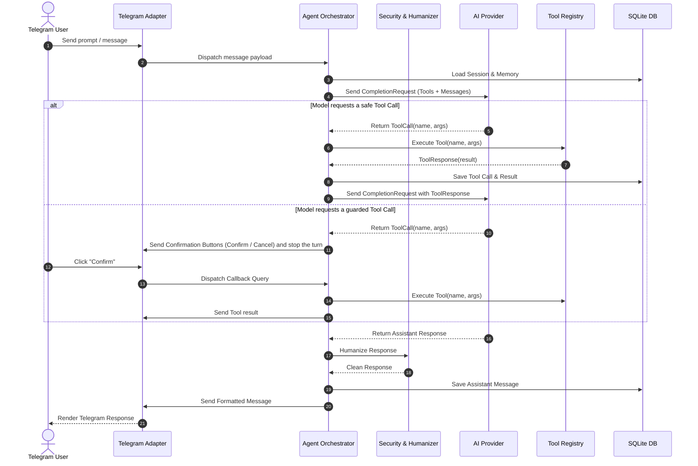
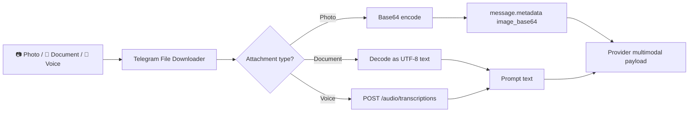

# System Architecture (v2.1.0)

Telegram Agent Platform is architected around Clean (Hexagonal) Architecture principles. Business logic, tool contracts, and orchestration remain strictly decoupled from transport protocols (Telegram Bot API), external AI model APIs, persistent storage, and OS-level execution environments.

```mermaid
graph TD
    subgraph Interfaces ["1. Interfaces Layer"]
        CLI["CLI Commands (setup / start / stop / status / doctor / config / backup / test / version)"]
        PollLoop["Telegram Long-Polling Receiver (no webhook, no listening port)"]
        CronLoop["Background Scheduler Worker (cron, interval, one-shot)"]
    end

    subgraph Application ["2. Application Layer"]
        Orchestrator["Agent Orchestrator (ReAct Loop, max 5 turns)"]
        SDLC["Multi-Agent SDLC Engine (4 stages)"]
        Scheduler["Timezone-aware Job Scheduler"]
        ConfigMgr["Config Manager (Pydantic / YAML / .env)"]
        Doctor["System Doctor Diagnostics"]
    end

    subgraph Domain ["3. Domain Layer"]
        Entities["Session | Message | ToolCall | ToolResponse | PendingConfirmation | TelegramUser"]
        Contracts["AIProvider Interface | BaseTool Contract | Repository Interface"]
        Enums["Role | AgentState | PermissionLevel | RiskLevel"]
    end

    subgraph Infrastructure ["4. Infrastructure Layer"]
        TgAdapter["Telegram Adapter (Long Polling Client, Formatter, Auth, setMyCommands)"]
        AIFactory["AI Provider Factory (9router, DeepSeek, Anthropic, Google, OpenRouter, Ollama, OpenCode Zen/Go, OpenAI/custom)"]
        ToolReg["Tool Registry (web_search, http_fetch, generate_chart, python_sandbox, get_weather, github, file_read/write/edit/delete, dir_list, shell_execute, opencode_session)"]
        SQLiteDB["SQLite Async Database (sessions, messages, agent_memory, scheduled_jobs)"]
        Security["Security Perimeter (SSRF Guard on http_fetch, Rate Limiter, Prompt Guard, Humanizer)"]
    end

    Interfaces --> Application
    Application --> Domain
    Infrastructure ..|> Domain
    Application --> Infrastructure
```

---

## 1. Domain Layer (`src/domain/`)

The Domain layer defines the enterprise business models and contracts with zero third-party dependencies.

### Core Entities & Value Objects
* **`Session`**: Represents an isolated conversational context bounded by `user_id` and `chat_id`. It holds the ordered message history and an `AgentState` (`IDLE`, `PROCESSING`, `WAITING_CONFIRMATION`, `ERROR`).
* **`Message`**: Encapsulates conversational turns (`SYSTEM`, `USER`, `ASSISTANT`, `TOOL`) with optional `ToolCall` and `ToolResponse` payloads plus free-form `metadata` (used to carry base64 image data).
* **`ToolCall` & `ToolResponse`**: Structured representations of agent tool invocations, input arguments, string outputs, and execution error states.
* **`PendingConfirmation`**: A confirmation awaiting a user's inline-button decision — action id, tool name, arguments, risk level, description, and owning user id.
* **`TelegramUser` / `AuthPolicy`**: User identity plus the allowlist, admin list, and private/group chat policy (`src/domain/user.py`).

Scheduled jobs are not a domain entity: `ScheduledJob` is an infrastructure dataclass in `src/infrastructure/scheduler/job_scheduler.py`.

### Security & Permission Enums
* **`PermissionLevel`**: `READ` (read-only queries), `WRITE` (modifies local files/state), `EXECUTE` (runs code/binaries), `DESTRUCTIVE` (high-risk operations).
* **`RiskLevel`**: `LOW` (safe for auto-execution), `MEDIUM` (logged and isolated), `HIGH` / `CRITICAL` (mandates explicit user button confirmation).

---

## 2. Application Layer (`src/application/`)

The Application layer implements use-case workflows, coordinates domain entities, and orchestrates the ReAct loop.

### `AgentOrchestrator`
The central runtime engine handling:
1. **Inbound Message Routing**: Distinguishes the 17 menu commands (`/start`, `/model`, `/provider`, `/agent`, `/sdlc`, `/oc`, `/schedule`, `/remind`, `/chart`, `/status`, `/settings`, `/tools`, `/memory`, `/lang`, `/reset`, `/cancel`, `/help`) plus `/admin` from standard conversation prompts.
2. **Session & Memory Context**: Injects long-term key-value memory and subagent persona instructions into the dynamic system prompt. Per-user settings are stored in `agent_memory` under reserved keys (`_active_provider`, `_active_model:<provider>`, `_language`) and are filtered out of `/memory`.
3. **ReAct Control Loop** (capped at **5 turns**, `max_turns = 5`):
   - Queries the active AI provider with user context and available tool schemas.
   - Parses model tool calls and executes them sequentially.
   - Evaluates the risk gate: safe tools execute immediately; a tool that needs confirmation stops the turn and posts an inline **Confirm** / **Cancel** button pair.
   - Feeds tool results back into model context until a final textual answer is reached.
4. **Language & Timezone**: Every reply is rendered through the i18n catalogue in the user's language (`_language`, falling back to `UI_LANG`). The scheduler interprets wall-clock times in `TIMEZONE` and echoes resolved timestamps in it.
5. **Humanizer Post-Processing**: Filters out repetitive AI boilerplate before message dispatch.



### `MultiAgentSDLC`
An autonomous 4-stage software engineering pipeline run by `/sdlc <task>`:
* **Stage 1 (Planner)**: Performs capability mapping and produces an architectural specification.
* **Stage 2 (Developer)**: Implements production-ready code fulfilling the specification.
* **Stage 3 (QA & Security)**: Verifies edge cases, checks for code vulnerabilities, and asserts correctness.
* **Stage 4 (Reviewer)**: Synthesizes artifacts and prepares deployment instructions.

Edits the Telegram progress message in real time (`25%` → `50%` → `75%` → `100%`).

### `SchedulerEngine`
Manages background execution through the SQLite-backed `JobScheduler`:
* Accepts 5-part cron expressions (`0 9 * * *`), recurring intervals (`every 1h`), relative delays (`10m`, `in 2h`), clock times (`18:00`), and ISO timestamps.
* **Timezone-aware**: cron fields, `HH:MM`, and naive ISO timestamps are interpreted in `TIMEZONE`; the next run is stored in UTC and reminder/schedule replies render it back in that zone with its offset.
* Triggers proactive background jobs and sends notifications to target Telegram chats.
* Supports `list` and `cancel <job_id>` via `/schedule`, and one-off reminders via `/remind`.

### `SystemDoctor`
`agent doctor` runs the configuration schema, inert `.env` key, timezone, `.gitignore`, SQLite, Telegram, AI provider, and OpenCode bridge checks. It exits with status 1 when any check FAILs.

---

## 3. Infrastructure Layer (`src/infrastructure/`)

The Infrastructure layer implements external integrations, data persistence, and security controls.

### Telegram Adapter (`src/infrastructure/telegram/`)
* **Long Polling Only**: The agent receives updates by calling `getUpdates` (10-second server timeout) in a loop. There is no HTTP server, no webhook mode, and no listening port.
* **Command Autocomplete (`setMyCommands`)**: Registers the 17 slash commands in the menu order of `BOT_COMMAND_KEYS`, in the active UI language, on startup.
* **Message Splitting**: `split_message_chunks()` chunks long responses at **4000 characters** without breaking Markdown or code blocks.
* **Callback Query Routing**: Handles inline keyboard events for model switching, destructive tool confirmations, and OpenCode permission relays.

### AI Providers (`src/infrastructure/ai/`)
Unified factory (`create_ai_provider`) supporting the canonical ids `9router`, `deepseek`, `anthropic`, `google`, `openai`, `openrouter`, `ollama`, `opencode-zen`, `opencode-go`, and `custom`. Per-provider credentials are resolved from prefixed env keys (`ANTHROPIC_API_KEY`, `OPENAI_BASE_URL`, ...), so `/provider` can switch at runtime without editing `.env`.

### Tool Registry (`src/infrastructure/tools/`)
* `web_search`: DuckDuckGo HTML search.
* `http_fetch`: SSRF-hardened HTTP crawler and API fetcher (character-capped).
* `generate_chart`: QuickChart URL plus ASCII bar rendering.
* `python_sandbox`: In-process AST-checked Python execution with a wall-clock timeout.
* `get_weather`: Open-Meteo current conditions and forecast.
* `github`: GitHub repository, file, and issue inspection (write gated by `GITHUB_ALLOW_WRITE`).
* `file_read` / `file_write` / `file_edit` / `file_delete` / `dir_list`: Path-jailed filesystem operations.
* `shell_execute`: Controlled shell execution requiring user approval.
* `opencode_session`: Drives a loopback-only local OpenCode server.

### Database & Storage (`src/infrastructure/database/`)
* **SQLite Asynchronous Storage**: Uses `aiosqlite` against `DATABASE_PATH` (default `data/agent.db`).
* **Tables**:
  * `sessions`: Conversation sessions indexed by `session_id` and `user_id`.
  * `messages`: Full message history with role, tool calls/responses, metadata, and timestamps.
  * `agent_memory`: Key-value persistent facts per user, including reserved `_`-prefixed settings.
  * `scheduled_jobs`: Cron jobs, intervals, and one-shot reminders with execution state.
  * `schema_migrations`: Applied migration versions.
* **Retention**: `MEMORY_ENABLED=false` stops memory injection; `DATA_RETENTION_DAYS > 0` purges stored memories older than that.

### Security Perimeter (`src/infrastructure/security/`)
* **SSRF Guard**: `is_safe_url()` resolves DNS hostnames and rejects private RFC 1918 ranges, loopback, link-local, multicast, reserved addresses, and cloud metadata endpoints. It is called by `http_fetch` only — see `docs/security/model.md`.
* **Rate Limiter**: Sliding 60-second window per Telegram user, sized by `RATE_LIMIT_REQUESTS_PER_MINUTE` (default 15).
* **Prompt Guard**: Wraps untrusted web/file/tool output in explicit data boundaries.
* **Humanizer**: Strips robotic AI phrases, preambles, and conversational padding.

### Process Supervision (`src/interfaces/cli/main.py`)
* `agent start` runs in the foreground; `agent start --detach` spawns a detached child that appends to `data/agent.log` (both stdout and stderr).
* The running instance writes its PID to `data/agent.pid`; `agent stop` drops the `data/agent.stop` sentinel the polling loop checks (and sends `SIGTERM` on POSIX), escalating to a hard kill after a grace period.
* Starting a second instance for the same bot token is refused unless `--force` is passed, which takes over instead.
* `agent status --check` exits non-zero when the agent is not running, which is what the Docker healthcheck uses.

---

## 4. Attachment Pipeline



1. **Ingestion**: The Telegram adapter captures `file_id`s for photos, documents, and voice/audio notes and downloads the bytes.
2. **Photos**: Encoded as base64 and attached to the message as `metadata["image_base64"]` (with `mime_type`). Providers that support images (`anthropic`, `google`, `openai`) inline them into the request payload. There is no vision or OCR preprocessing stage.
3. **Documents**: Decoded as UTF-8 text; a 4000-character snippet is embedded into the prompt together with the file name, MIME type, and size. Binary documents are described rather than parsed.
4. **Voice Notes**: Sent to an OpenAI-compatible `/audio/transcriptions` endpoint using `AI_API_KEY` and the configured base URL; the transcript is injected as text. A provider that does not expose that endpoint returns no transcript.
