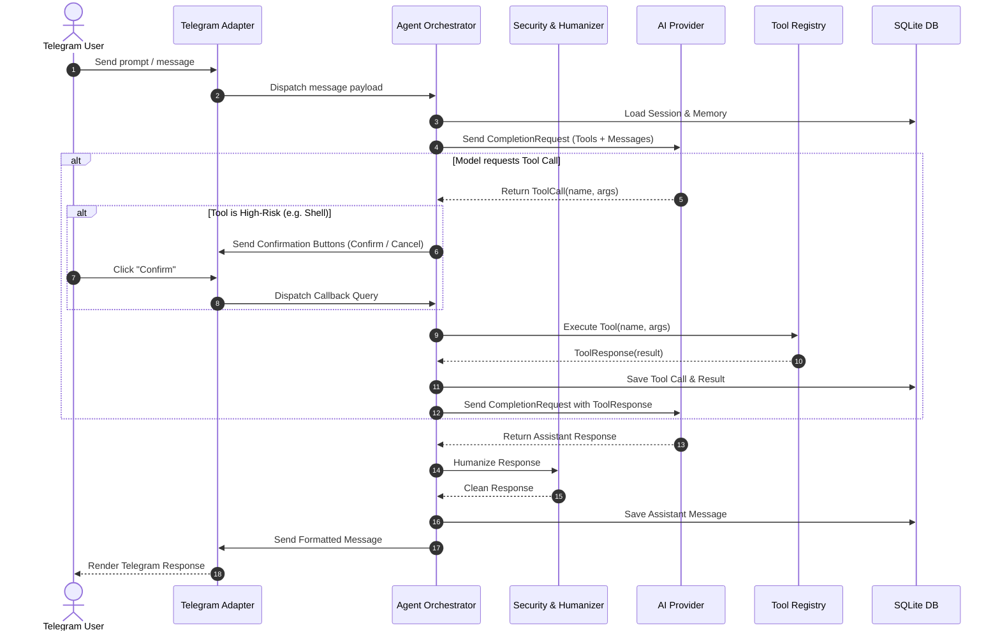
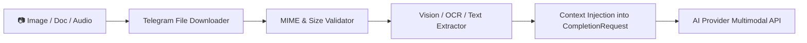

# System Architecture (v2.0)

Telegram Agent Platform is architected around Clean (Hexagonal) Architecture principles. Business logic, tool contracts, and orchestration remain strictly decoupled from transport protocols (Telegram Bot API), external AI model APIs, persistent storage, and OS-level execution environments.

```mermaid
graph TD
    subgraph Interfaces ["1. Interfaces Layer"]
        CLI["CLI Commands (start / stop / doctor / setup)"]
        PollLoop["Telegram Polling / Webhook Receiver"]
        CronLoop["Background Cron & Reminder Worker"]
    end

    subgraph Application ["2. Application Layer"]
        Orchestrator["Agent Orchestrator (ReAct Loop)"]
        SDLC["Multi-Agent SDLC Engine"]
        Scheduler["Scheduler & Task Manager"]
        ConfigMgr["Config Manager (Pydantic / YAML / .env)"]
        Doctor["System Doctor Diagnostics"]
    end

    subgraph Domain ["3. Domain Layer"]
        Entities["Session | Message | ToolCall | ToolResponse | TelegramUser | ScheduledTask"]
        Contracts["AIProvider Interface | BaseTool Contract | Repository Interface"]
        Enums["Role | PermissionLevel | RiskLevel | SDLCPhase"]
    end

    subgraph Infrastructure ["4. Infrastructure Layer"]
        TgAdapter["Telegram Adapter (API Client, Formatter, Auth, setMyCommands)"]
        AIFactory["AI Provider Factory (9router, DeepSeek, Claude, Gemini, OpenAI, Ollama)"]
        ToolReg["Tool Registry (Python Sandbox, HTTP Fetcher, Weather, Charts, FS, Shell, GitHub)"]
        SQLiteDB["SQLite Async Database (Sessions, Memories, ScheduledTasks)"]
        Security["Security Perimeter (SSRF Guard, Rate Limiter, Prompt Guard, Humanizer)"]
    end

    Interfaces --> Application
    Application --> Domain
    Infrastructure ..|> Domain
    Application --> Infrastructure
```

---

## 1. Domain Layer (`src/domain/`)

The Domain layer defines the enterprise business models and contracts with zero external library dependencies.

### Core Entities & Value Objects
* **`Session`**: Represents an isolated conversational context bounded by `user_id` and `chat_id`. Manages the ordered sequence of messages and tracks active subagent state.
* **`Message`**: Encapsulates conversational turns (`USER`, `ASSISTANT`, `SYSTEM`, `TOOL`) with optional `ToolCall` and `ToolResponse` payloads.
* **`ToolCall` & `ToolResponse`**: Structured representations of agent tool invocations, input arguments, string outputs, and execution error states.
* **`TelegramUser`**: Domain model representing authenticated Telegram users, authorization status, and admin privileges.
* **`ScheduledTask`**: Represents cron jobs and one-shot reminder schedules with expression syntax, target chat IDs, and action payloads.
* **`MediaAttachment`**: Encapsulates multimodal media objects (images, documents, audio clips) with MIME metadata and local storage buffers.

### Security & Permission Enums
* **`PermissionLevel`**: `READ` (read-only queries), `WRITE` (modifies local files/state), `EXECUTE` (runs code/binaries), `DESTRUCTIVE` (high-risk operations).
* **`RiskLevel`**: `LOW` (safe for auto-execution), `MEDIUM` (logged and sandboxed), `HIGH` (mandates explicit user button confirmation).

---

## 2. Application Layer (`src/application/`)

The Application layer implements use-case workflows, coordinates domain entities, and orchestrates the ReAct loop.

### `AgentOrchestrator`
The central runtime engine handling:
1. **Inbound Message Routing**: Distinguishes slash commands (`/model`, `/agent`, `/sdlc`, `/schedule`, `/remind`) from standard conversation prompts.
2. **Session & Memory Context**: Injects long-term key-value memory and subagent persona instructions into the dynamic system prompt.
3. **ReAct Control Loop**:
   - Queries the active AI provider with user context and available tool schemas.
   - Parses model tool calls.
   - Evaluates risk levels: safe tools execute immediately; high-risk tools generate an interactive Telegram inline confirmation button.
   - Feeds tool results back into model context until a final textual answer is reached (capped at 5 ReAct iterations).
4. **Humanizer Post-Processing**: Filters out repetitive AI boilerplate before message dispatch.



### `MultiAgentSDLC`
An autonomous 4-stage software engineering pipeline:
* **Stage 1 (Planner)**: Performs capability mapping and produces an architectural specification.
* **Stage 2 (Developer)**: Implements production-ready code fulfilling the specification.
* **Stage 3 (QA & Security)**: Verifies edge cases, checks for code vulnerabilities, and asserts correctness.
* **Stage 4 (Reviewer)**: Synthesizes artifacts and prepares deployment instructions.

Edits Telegram message progress in real-time (`25%` → `50%` → `75%` → `100%`).

### `SchedulerEngine`
Manages background task execution:
* Computes next execution times for standard 5-part cron expressions (`0 9 * * *`) and relative durations (`30m`, `2h`).
* Triggers proactive background jobs and sends notifications to target Telegram chats.
* Supports active schedule cancellation via `/cancel`.

---

## 3. Infrastructure Layer (`src/infrastructure/`)

The Infrastructure layer implements external integrations, data persistence, and security controls.

### Telegram Adapter (`src/infrastructure/telegram/`)
* **Async Polling & Dispatch**: Non-blocking `getUpdates` long-polling loop with exponential backoff on network errors.
* **Command Autocomplete (`setMyCommands`)**: Auto-registers slash commands with Telegram Bot API on startup so users receive instant popup autocomplete.
* **Message Splitting**: Chunks long responses (>4096 characters) without breaking Markdown formatting or code blocks.
* **Callback Query Routing**: Handles inline keyboard events for model switching and destructive tool confirmations.

### AI Providers (`src/infrastructure/ai/`)
Unified factory supporting:
* **9router**: High-performance local routing gateway.
* **DeepSeek**: Official API supporting `deepseek-chat` (V3) and `deepseek-reasoner` (R1).
* **Anthropic**: Claude 3.5 / 3.7 models with native tool calling.
* **Google Gemini**: Gemini 2.0 Flash / Pro models.
* **OpenAI & OpenRouter**: GPT-4o, o3-mini, and catalog proxies.
* **Ollama**: Local offline LLM execution.

### Tool Registry (`src/infrastructure/tools/`)
* `web_search`: DuckDuckGo HTML search.
* `python_sandbox`: Isolated Python script execution.
* `http_fetch`: SSRF-hardened HTTP crawler and API fetcher.
* `weather`: Real-time weather and forecast lookups.
* `generate_chart`: Visual graph and plot generation dispatched as Telegram photos.
* `file_read` / `file_write`: Path-jailed filesystem operations.
* `github`: GitHub repository, issue, and PR inspection.
* `shell_execute`: Controlled shell execution requiring user approval.

### Database & Storage (`src/infrastructure/database/`)
* **SQLite Asynchronous Storage**: Uses `aiosqlite` with connection pooling.
* **Tables**:
  * `sessions`: Conversation sessions indexed by `session_id` and `user_id`.
  * `messages`: Full message history with role, tool calls, and timestamps.
  * `memories`: Key-value persistent facts per user (`_active_model`, custom preferences).
  * `scheduled_tasks`: Cron jobs, reminder triggers, and execution states.

### Security Perimeter (`src/infrastructure/security/`)
* **SSRF Guard**: Resolves DNS hostnames and prevents requests targeting private RFC 1918 subnets (`10.0.0.0/8`, `172.16.0.0/12`, `192.168.0.0/16`), loopback (`127.0.0.1`), and cloud metadata services (`169.254.169.254`).
* **Rate Limiter**: Sliding-window rate limiter preventing API abuse and denial-of-service.
* **Prompt Guard**: Enforces strict boundary encapsulation around untrusted web and tool outputs.
* **Humanizer**: Strips robotic AI phrases, preambles, and conversational padding.

---

## 4. Multimodal Processing Pipeline



1. **Ingestion**: Telegram adapter captures file IDs for incoming photos, audio voice notes, and document files.
2. **Validation**: Files are checked against allowed MIME types and maximum size constraints.
3. **Preprocessing**: Images are converted to base64 or vision payloads; documents (PDF/TXT) are parsed and chunked.
4. **Model Execution**: The multimodal payload is passed directly to compatible AI models (e.g. `gemini-2.0-flash`, `gpt-4o`, `claude-3-7-sonnet`).

