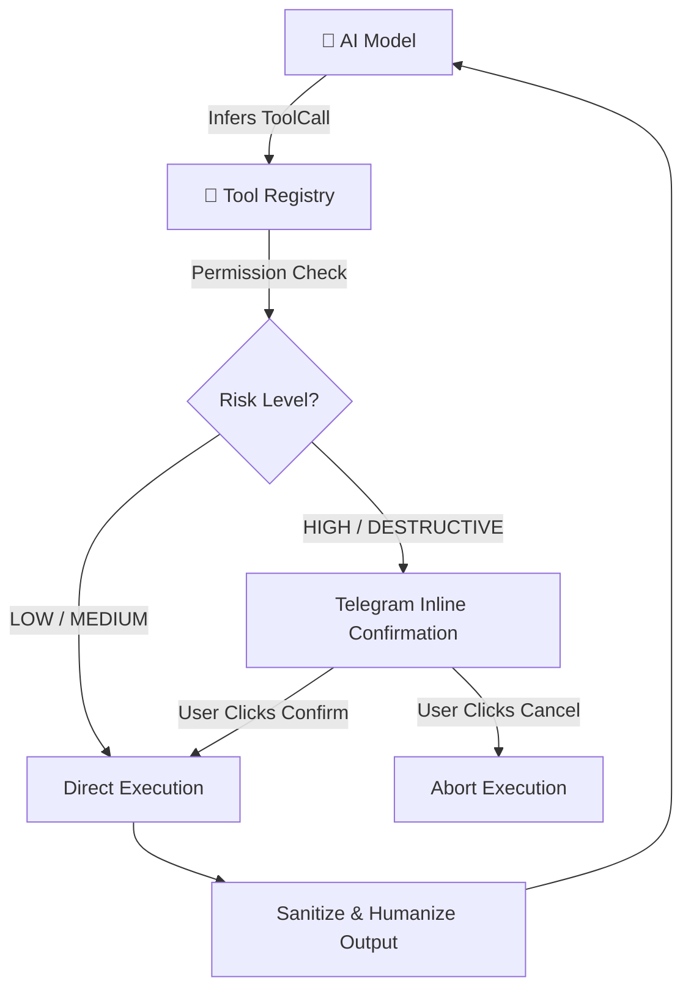
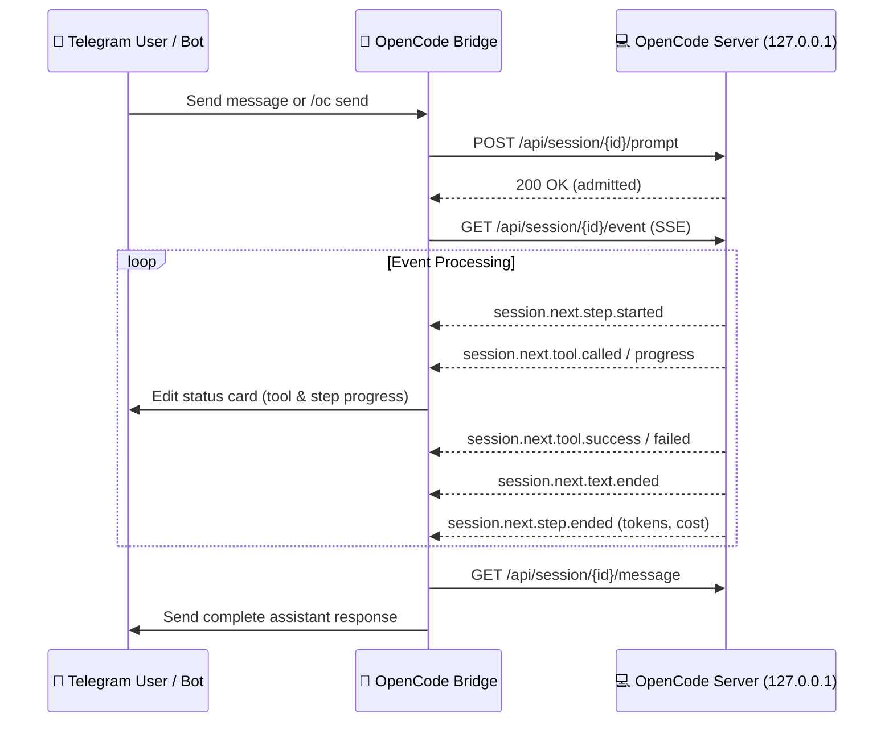

# Tool Integration & Extension Guide (v2.0)

Telegram Agent Platform features an extensible tool registry with granular permission tiers, SSRF protection, path jailement, and interactive confirmation gates for high-risk actions.

---

## Built-in & Extended Tool Suite



### 1. Web Search (`web_search`)
* **Purpose**: Fetches real-time public web information without API keys via DuckDuckGo HTML scraping.
* **Security**: Automatically strips raw HTML tags and wraps snippets in untrusted prompt delimiters to mitigate prompt injection.
* **Permission**: `READ` | **Risk**: `LOW`
* **Schema**:
  ```json
  {
    "name": "web_search",
    "description": "Search the web for current information and facts.",
    "parameters": {
      "type": "object",
      "properties": {
        "query": { "type": "string", "description": "Search query keywords" },
        "max_results": { "type": "integer", "description": "Number of results (1-5)", "default": 3 }
      },
      "required": ["query"]
    }
  }
  ```

### 2. Python Sandbox (`python_sandbox`)
* **Purpose**: Runs computational scripts, data analysis, or algorithmic verification in an isolated process.
* **Security**:
  * Strict execution timeout (default 15 seconds).
  * Restricted standard library and process isolation.
  * Standard output (`stdout`) and error (`stderr`) capture.
* **Permission**: `EXECUTE` | **Risk**: `MEDIUM`
* **Schema**:
  ```json
  {
    "name": "python_sandbox",
    "description": "Execute a Python script in an isolated runtime environment.",
    "parameters": {
      "type": "object",
      "properties": {
        "code": { "type": "string", "description": "Python code snippet to execute" }
      },
      "required": ["code"]
    }
  }
  ```

### 3. HTTP Fetcher (`http_fetch`)
* **Purpose**: Fetches web page content, documentation, or public API endpoints.
* **Security**:
  * **SSRF Guard**: Pre-resolves IP addresses and drops any connection targeting private subnets (`10.0.0.0/8`, `172.16.0.0/12`, `192.168.0.0/16`, `127.0.0.1`) or cloud metadata endpoints (`169.254.169.254`).
  * Enforces maximum response body size limits (default 1MB).
  * Converts HTML bodies to clean Markdown text.
* **Permission**: `READ` | **Risk**: `LOW`
* **Schema**:
  ```json
  {
    "name": "http_fetch",
    "description": "Fetch content from a public URL via HTTP GET with SSRF protection.",
    "parameters": {
      "type": "object",
      "properties": {
        "url": { "type": "string", "description": "Fully qualified HTTP/HTTPS URL" },
        "headers": { "type": "object", "description": "Optional HTTP request headers" }
      },
      "required": ["url"]
    }
  }
  ```

### 4. Weather API (`weather`)
* **Purpose**: Retrieves current atmospheric conditions and multi-day meteorological forecasts.
* **Security**: Validates geographic coordinates and city names before dispatch.
* **Permission**: `READ` | **Risk**: `LOW`
* **Schema**:
  ```json
  {
    "name": "weather",
    "description": "Get current weather conditions or multi-day forecasts for a location.",
    "parameters": {
      "type": "object",
      "properties": {
        "location": { "type": "string", "description": "City name or coordinates (e.g. 'Jakarta' or '-6.2,106.8')" },
        "forecast_days": { "type": "integer", "description": "Number of forecast days (1-7)", "default": 1 }
      },
      "required": ["location"]
    }
  }
  ```

### 5. Chart Generator (`generate_chart`)
* **Purpose**: Generates visual diagrams and plots (line, bar, pie, scatter) and dispatches them directly to the Telegram chat as native photo messages.
* **Security**: Generates images in-memory or in isolated temporary buffers with immediate garbage collection.
* **Permission**: `WRITE` | **Risk**: `LOW`
* **Schema**:
  ```json
  {
    "name": "generate_chart",
    "description": "Generate visual charts (line, bar, pie, scatter) and send as image.",
    "parameters": {
      "type": "object",
      "properties": {
        "chart_type": { "type": "string", "enum": ["line", "bar", "pie", "scatter"], "description": "Chart visual type" },
        "title": { "type": "string", "description": "Title of the chart" },
        "data": { "type": "object", "description": "Key-value or X-Y series data points" }
      },
      "required": ["chart_type", "title", "data"]
    }
  }
  ```

### 6. Filesystem Manager (`file_read`, `file_write`, `list_directory`)
* **Purpose**: Reads, writes, and lists files within the configured workspace.
* **Security**:
  * Jailed strictly to `FILESYSTEM_ROOT_DIR` (default `./data`).
  * Enforces `os.path.commonpath` verification to prevent `../` directory traversal.
  * Read-only mode can be enforced via `FILESYSTEM_READ_ONLY=true`.
* **Permission**: `READ` / `WRITE` | **Risk**: `LOW` / `MEDIUM`

### 7. GitHub Integration (`github`)
* **Purpose**: Inspects repositories, reads file contents, browses directory trees, tracks issues, and manages pull requests. Works with public repositories out-of-the-box without a token.
* **Supported Actions**:
  * `get_file` / `read_file`: Fetches raw file text directly via GitHub REST API without third-party mirrors.
  * `list_files` / `list_dir`: Lists repository folder entries with file sizes and paths.
  * `get_repo`: Retrieves repository metadata, star counts, and default branch.
  * `list_issues` / `get_issue`: Inspects open bug reports and discussions.
  * `create_issue`: Submits new issues (requires `GITHUB_ALLOW_WRITE=true` and `GITHUB_TOKEN`).
* **Security**: Read operations are rate-guarded and run without privileges. Write actions require explicit configuration.
* **Permission**: `READ` / `WRITE` | **Risk**: `LOW`

### 8. Shell Executor (`shell_execute`)
* **Purpose**: Runs terminal commands on the host environment when explicitly enabled.
* **Security**:
  * Disabled by default (`ALLOW_SHELL=false`).
  * Hardcoded blacklist for destructive commands (`rm -rf /`, `mkfs`, `dd`, `shutdown`, `reboot`, fork bombs).
  * **Requires interactive user confirmation** in Telegram before execution starts.
* **Permission**: `EXECUTE` | **Risk**: `HIGH`

---

## Tool Permission & Risk Matrix

| Tool | Permission Level | Risk Tier | Auto-Execute | Confirmation Gate |
| :--- | :--- | :--- | :---: | :---: |
| `web_search` | `READ` | `LOW` | ✅ Yes | ❌ No |
| `weather` | `READ` | `LOW` | ✅ Yes | ❌ No |
| `http_fetch` | `READ` | `LOW` | ✅ Yes | ❌ No |
| `generate_chart` | `WRITE` | `LOW` | ✅ Yes | ❌ No |
| `file_read` | `READ` | `LOW` | ✅ Yes | ❌ No |
| `list_directory` | `READ` | `LOW` | ✅ Yes | ❌ No |
| `github` (read) | `READ` | `LOW` | ✅ Yes | ❌ No |
| `python_sandbox` | `EXECUTE` | `MEDIUM` | ✅ Yes | ❌ No |
| `file_write` | `WRITE` | `MEDIUM` | ✅ Yes | ❌ No |
| `github` (write) | `WRITE` | `MEDIUM` | ✅ Yes | ❌ No |
| `shell_execute` | `EXECUTE` | `HIGH` | ❌ No | ✅ **Required** |

---

## OpenCode Mirror Mode

The OpenCode Mirror Mode allows Telegram Agent to mirror and drive an active, locally running OpenCode coding agent session (`opencode serve`) directly from Telegram with real-time text streaming, tool call tracking, turn interruption, model/agent switching, and interactive permission handling. The local OpenCode agent itself runs backed by the user's 9router gateway (e.g. `aseli-combo` or custom provider profiles).

### 1. Prerequisites

* An active OpenCode server instance running on the local machine:
  ```bash
  opencode serve --port 4096 --hostname 127.0.0.1
  ```
* Loopback access: OpenCode must listen strictly on `127.0.0.1` (port `4096` by default). Remote or LAN IP addresses are rejected by the bridge.
* Backend configuration: The local OpenCode server is configured to route LLM completions through the local 9router gateway.

### 2. HTTP Endpoints

The bridge interacts with OpenCode via the following local REST and Server-Sent Events (SSE) endpoints:

| Endpoint | Method | Payload / Response | Description |
| :--- | :---: | :--- | :--- |
| `/api/session/{id}/prompt` | `POST` | `{"prompt":{"text":"..."}}` (returns 200) | Submits a prompt to the session; returns immediately without blocking. |
| `/api/session/{id}/event` | `GET` | SSE stream: `data: {"id","type","durable","data"}` | Streams real-time session execution events. |
| `/api/session/{id}/interrupt` | `POST` | `empty` (returns 204) | Immediately stops/aborts current execution turn. |
| `/api/session/{id}/model` | `POST` | `{"model":{"id":"...","providerID":"..."}}` (returns 204) | Switches the active language model for the session. |
| `/api/session/{id}/agent` | `POST` | `{"agent":"..."}` (returns 204) | Switches the active agent persona (e.g. `sisyphus`). |
| `/api/session/{id}/permission/{req}/reply` | `POST` | `{"reply":"once"\|"always"\|"reject"}` (returns 204) | Relays user confirmation for guarded tool or shell actions. |
| `/api/session/{id}/message` | `GET` | `{"data":[{...content[]...}]}` | Fetches full message history and final assistant response. |
| `/api/agent` | `GET` | List of available agent objects | Queries registered OpenCode agent personas. |
| `/api/model` | `GET` | List of configured model profiles | Queries available models and upstream provider IDs. |
| `/api/command` | `GET` | List of workspace commands | Queries custom slash commands configured in OpenCode. |
| `/api/skill` | `GET` | List of workspace skills | Queries custom skills available in the environment. |

### 3. Event Flow & Consumed Event Types

Execution state is consumed over the SSE stream (`/api/session/{id}/event`). The bridge processes the following event lifecycle:



* **Text Events**:
  * `session.next.text.started`: Agent initiated text generation.
  * `session.next.text.ended`: Chunk or turn text completed with `data.text`.
* **Tool & Command Events**:
  * `session.next.tool.called`: Tool invocation initiated with tool name and arguments.
  * `session.next.tool.progress`: Intermediate output from long-running tool operations.
  * `session.next.tool.success`: Tool execution finished successfully.
  * `session.next.tool.failed`: Tool execution failed with an error payload.
  * `session.next.shell.started`: Shell command invocation started.
* **Step & Turn Lifecycle**:
  * `session.next.prompt.admitted` / `session.next.prompted`: Prompt queued and accepted by agent.
  * `session.next.step.started`: Execution step initiated.
  * `session.next.step.ended`: Step completed with `finish` reason, token counts, and cost metadata.
  * `session.next.step.failed`: Step encountered an unrecoverable failure.

### 4. Command Reference

The `/oc` command provides full control of local OpenCode sessions directly from Telegram:

| Command | Arguments | Description |
| :--- | :--- | :--- |
| `/oc list` | — | List all active and recent OpenCode sessions. |
| `/oc attach` | `<session_id>` | Attach chat to an active OpenCode session. Future chat messages drive this session. |
| `/oc detach` | — | Detach from active mirrored session; revert chat to standard bot orchestrator. |
| `/oc new` | `[title]` | Create a new OpenCode session and attach to it immediately. |
| `/oc send` | `<prompt>` | Dispatch a one-off prompt to an attached or specified session. |
| `/oc stop` | — | Interrupt active tool execution or prompt generation turn immediately. |
| `/oc model` | `[model_id] [provider_id]` | Inspect current model or switch to a target model (e.g. `/oc model aseli-combo 9router`). |
| `/oc models` | — | List available models provided by OpenCode and the underlying 9router gateway. |
| `/oc agent` | `[agent_name]` | View active agent or switch persona (e.g. `/oc agent sisyphus`). |
| `/oc agents` | — | List all available agent personas registered in OpenCode. |
| `/oc commands` | — | List available custom slash commands in OpenCode. |
| `/oc skills` | — | List available skills registered in OpenCode workspace. |
| `/oc diff` | — | View unstaged changes and git working tree diff from the active session. |

### 5. Safety & Security Model

OpenCode Mirror Mode operates under a defense-in-depth safety architecture:

* **Loopback-Only Guard**: The bridge strictly connects to `127.0.0.1` or `localhost`. Any attempt to configure or route to remote IP addresses, LAN interfaces, or external domains is rejected before request dispatch.
* **Opt-In Attachment**: Mirroring is disabled by default. The Telegram bot only relays messages to OpenCode when an explicit `/oc attach <session_id>` or `/oc new` command is issued for that chat.
* **Zero Credential Forwarding**: The Telegram bot communicates solely over the unauthenticated local HTTP port (4096). The user's 9router API key and Telegram bot token are never forwarded, logged, or exposed to the OpenCode daemon.
* **Permission Relay**: When OpenCode triggers a protected or dangerous operation (such as shell commands or filesystem mutations), it generates a permission request event. The bot intercepts this and renders an inline Telegram confirmation keyboard with **Approve Once**, **Always Allow**, and **Reject** buttons, forwarding the user's decision to `POST /api/session/{id}/permission/{req}/reply`.

---

## Implementing a Custom Tool

To add a new tool to the agent runtime:

### 1. Inherit from `BaseTool`
Create a new file under `src/infrastructure/tools/`:

```python
from typing import Any, Dict
from src.domain.tool import BaseTool, ToolDefinition, PermissionLevel, RiskLevel, ToolExecutionResult

class CustomCalculatorTool(BaseTool):
    """Custom mathematical computation tool."""

    @property
    def definition(self) -> ToolDefinition:
        return ToolDefinition(
            name="calculate",
            description="Evaluate complex mathematical expressions.",
            parameters={
                "type": "object",
                "properties": {
                    "expression": {"type": "string", "description": "Mathematical expression, e.g. 'sqrt(144) + 12'"}
                },
                "required": ["expression"]
            },
            permission=PermissionLevel.EXECUTE,
            risk_level=RiskLevel.LOW
        )

    async def execute(self, arguments: Dict[str, Any], user_id: int) -> ToolExecutionResult:
        expression = arguments.get("expression", "")
        try:
            # Safe evaluation logic here
            result = str(eval(expression, {"__builtins__": {}}, {}))
            return ToolExecutionResult(content=f"Result: {result}", is_error=False)
        except Exception as e:
            return ToolExecutionResult(content=f"Math Error: {str(e)}", is_error=True)
```

### 2. Register with `ToolRegistry`
In `src/infrastructure/tools/registry.py`:

```python
registry.register(CustomCalculatorTool())
```
The tool will automatically be advertised to the AI model in all subsequent completion requests.

