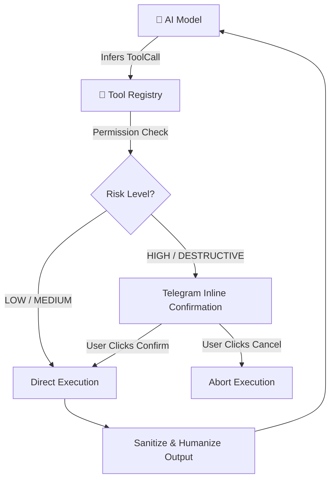
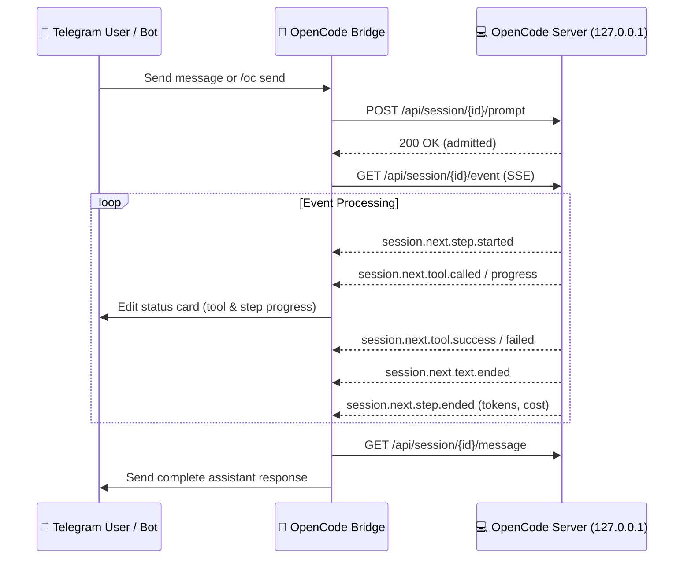

# Tool Integration & Extension Guide (v2.1.0)

Telegram Agent Platform features an extensible tool registry with granular permission tiers, optional SSRF protection (used by `http_fetch`), a filesystem path jail, and interactive confirmation gates for high-risk actions.

---

## Built-in & Extended Tool Suite



### 1. Web Search (`web_search`)
* **Purpose**: Fetches real-time public web information without API keys via DuckDuckGo HTML scraping (`https://html.duckduckgo.com/html/`).
* **Security**: Strips raw HTML tags and wraps the snippets in untrusted prompt delimiters to mitigate prompt injection. It does **not** call `is_safe_url()` — the destination host is hardcoded.
* **Permission**: `READ` | **Risk**: `LOW` | **Confirmation**: no
* **Enabled by**: `ENABLE_WEB_SEARCH` (default `true`)
* **Schema**:
  ```json
  {
    "name": "web_search",
    "description": "Search the web for current information, documentation, news, or general facts.",
    "parameters": {
      "type": "object",
      "properties": {
        "query": { "type": "string", "description": "The search keywords or question." }
      },
      "required": ["query"]
    }
  }
  ```

### 2. Python Sandbox (`python_sandbox`)
* **Purpose**: Runs mathematics, statistics, and data-transformation snippets in an in-process sandbox and captures `stdout`/`result`.
* **Security**:
  * Execution timeout default **5.0 seconds**, configurable per call via `timeout_seconds` and clamped to `0.1`–`30.0` seconds (`PYTHON_SANDBOX_TIMEOUT_SECONDS` sets the default).
  * An AST validator runs before execution: imports are restricted to a whitelist (`math`, `statistics`, `json`, `random`, `datetime`, `re`, `collections`, `itertools`, `functools`, `decimal`, `fractions`) and calls/attributes such as `open`, `eval`, `exec`, `compile`, `getattr`, `__subclasses__`, `__globals__` are rejected.
  * A loop-guard transformer injects iteration limits into loop bodies; `asyncio.wait_for` enforces the wall-clock timeout.
  * There is **no** memory or CPU limit and no separate process — isolation is the AST check plus the timeout.
* **Permission**: `EXECUTE` | **Risk**: `MEDIUM` | **Confirmation**: no
* **Enabled by**: `ENABLE_PYTHON_SANDBOX` (default `true`)
* **Schema**:
  ```json
  {
    "name": "python_sandbox",
    "description": "Execute Python code safely in an isolated environment for mathematics, statistics, data transformations, or logic. Set variable `result` or `print()` to output.",
    "parameters": {
      "type": "object",
      "properties": {
        "code": { "type": "string", "description": "The Python code snippet to execute." },
        "timeout_seconds": { "type": "number", "description": "Maximum execution time in seconds (default: 5.0)." }
      },
      "required": ["code"]
    }
  }
  ```

### 3. HTTP Fetcher (`http_fetch`)
* **Purpose**: Fetches web page content, documentation, or public API endpoints.
* **Security**:
  * **SSRF Guard**: Calls `is_safe_url()` (`src/infrastructure/security/ssrf_guard.py`) before dispatch. It rejects non-`http`/`https` schemes, blocked hostnames (`localhost`, `metadata.google.internal`, `instance-data`, `169.254.169.254`), and any resolved address that is private, loopback, link-local, multicast, or reserved.
  * Caps the returned text by **characters**, not bytes: `max_chars` defaults to `4000` and is hard-capped at `16000`.
  * Converts HTML bodies to readable text; JSON, plain-text and Markdown bodies are returned as-is.
* **Permission**: `READ` | **Risk**: `LOW` | **Confirmation**: no
* **Enabled by**: `ENABLE_HTTP_FETCH` (default `true`); `HTTP_FETCH_TIMEOUT_SECONDS` sets the request timeout (default `15`).
* **Schema**:
  ```json
  {
    "name": "http_fetch",
    "description": "Fetch the text and article content from a web page URL safely with SSRF protection.",
    "parameters": {
      "type": "object",
      "properties": {
        "url": { "type": "string", "description": "The full HTTP/HTTPS URL of the web page to fetch." },
        "max_chars": { "type": "integer", "description": "Maximum number of characters of extracted text to return (default: 4000)." }
      },
      "required": ["url"]
    }
  }
  ```

### 4. Weather API (`get_weather`)
* **Purpose**: Retrieves current conditions and a multi-day forecast from Open-Meteo by city name or latitude/longitude. No API key needed.
* **Security**: Validates the coordinates or geocoded city before dispatch. It does not call `is_safe_url()` — the destination hosts are hardcoded Open-Meteo endpoints.
* **Permission**: `READ` | **Risk**: `LOW` | **Confirmation**: no
* **Enabled by**: `ENABLE_WEATHER` (default `true`); `WEATHER_TIMEOUT_SECONDS` sets the request timeout (default `12`).
* **Parameters**: `city` **or** `location` (one is required), and optional `days`.
* **Schema**:
  ```json
  {
    "name": "get_weather",
    "description": "Get current weather and multi-day forecast for any city or latitude/longitude coordinates using Open-Meteo.",
    "parameters": {
      "type": "object",
      "properties": {
        "city": { "type": "string", "description": "City name (e.g. 'Jakarta', 'Tokyo', 'London') or query 'weather in Tokyo'." },
        "location": { "type": "string", "description": "City name or coordinates 'latitude,longitude' (e.g. '-6.2088,106.8456')." },
        "days": { "type": "integer", "description": "Number of forecast days (1 to 7, default: 3)." }
      }
    }
  }
  ```

### 5. Chart Generator (`generate_chart`)
* **Purpose**: Builds a QuickChart URL for a chart and renders the same data as an ASCII bar chart. Both are returned as text; the tool does not upload a photo itself.
* **Security**: Read-only. It constructs a QuickChart URL and formats text; nothing is written to disk or the chat.
* **Permission**: `READ` | **Risk**: `LOW` | **Confirmation**: no
* **Enabled by**: `ENABLE_CHART` (default `true`)
* **Schema**:
  ```json
  {
    "name": "generate_chart",
    "description": "Generate visual charts (bar, line, pie, doughnut, radar) with QuickChart URL and ASCII text representation.",
    "parameters": {
      "type": "object",
      "properties": {
        "chart_type": { "type": "string", "enum": ["bar", "line", "pie", "doughnut", "radar", "polarArea"], "description": "The type of chart to generate (default: 'bar')." },
        "title": { "type": "string", "description": "Chart title or heading." },
        "labels": { "type": "array", "items": {"type": "string"}, "description": "List of category labels for X-axis / slices." },
        "values": { "type": "array", "items": {"type": "number"}, "description": "Numerical data points corresponding to labels." },
        "dataset_label": { "type": "string", "description": "Label for the series (default: 'Values')." }
      },
      "required": ["labels", "values"]
    }
  }
  ```

### 6. Filesystem Suite (`file_read`, `file_write`, `file_edit`, `file_delete`, `dir_list`)
* **Purpose**: Reads, writes, edits, deletes, and lists files within the configured workspace.
* **Security**:
  * Jailed strictly to `FILESYSTEM_ROOT_DIR` (default `./data`; the wizard and `.env.example` use the project root `.`).
  * Every path goes through `is_path_safe()`, which resolves both paths and requires `os.path.commonpath` to equal the root, blocking `../` traversal.
  * `FILESYSTEM_READ_ONLY=true` blocks `file_write`, `file_edit`, and `file_delete`; they return an error instead of touching disk.
  * `file_read` returns at most 50,000 bytes; `dir_list` returns at most 100 entries.
* **Permission**: see the matrix below (`file_delete` is `DESTRUCTIVE`/`HIGH` and asks for confirmation).

| Tool | Parameters | Required | Permission | Risk |
| :--- | :--- | :--- | :--- | :--- |
| `file_read` | `file_path` (relative path) | `file_path` | `READ` | `LOW` |
| `file_write` | `file_path`, `content` | both | `WRITE` | `MEDIUM` |
| `file_edit` | `file_path`, `old_text`, `new_text`, `replace_all` (bool, default `false`) | first three | `WRITE` | `MEDIUM` |
| `file_delete` | `file_path` | `file_path` | `DESTRUCTIVE` | `HIGH` |
| `dir_list` | `dir_path` (default `""` = root) | — | `READ` | `LOW` |

### 7. GitHub Integration (`github`)
* **Purpose**: Reads repositories and issues over the GitHub REST API (`https://api.github.com`). Works with public repositories out-of-the-box without a token.
* **Supported Actions** (the `action` argument):
  * `get_file` / `read_file`: Fetches raw file text directly via the GitHub REST API.
  * `list_files` / `list_dir`: Lists repository folder entries with names and types.
  * `get_repo`: Retrieves repository metadata and default branch.
  * `list_issues` / `get_issue`: Inspects issues and pull requests (`issue_number`).
  * `create_issue`: Submits a new issue. Requires `GITHUB_ALLOW_WRITE=true` **and** `GITHUB_TOKEN`; otherwise the tool returns an error.
* **Security**: The tool is classified `READ`/`LOW` and never asks for confirmation; write access is gated entirely by `GITHUB_ALLOW_WRITE`. It does not call `is_safe_url()` — the host is hardcoded.
* **Enabled by**: `ENABLE_GITHUB` (default `true`); `GITHUB_TOKEN`, `GITHUB_DEFAULT_REPO`, `GITHUB_ALLOW_WRITE` configure it.
* **Permission**: `READ` | **Risk**: `LOW` | **Confirmation**: no
* **Parameters**: `action` (required), `repo` (`owner/repo`, defaults to `GITHUB_DEFAULT_REPO`), `path` (with alias `file_path`), `ref`, `issue_number`, `title`, `body`.

### 8. Shell Executor (`shell_execute`)
* **Purpose**: Runs terminal commands on the host environment when explicitly enabled. Commands are spawned as an argv list (`pwsh`/`cmd` on Windows, `bash`/`sh` elsewhere) — never with `shell=True`.
* **Security**:
  * Disabled by default (`ALLOW_SHELL=false`).
  * A hardcoded regex blacklist rejects destructive commands: `rm -r*`, `mkfs`, `dd if=`, `shutdown`, `reboot`, `format`, `git push --force`, `drop database`. `ALLOW_DESTRUCTIVE_SHELL` relaxes this; `SHELL_TIMEOUT_SECONDS` bounds execution (default `30`).
  * **Requires interactive user confirmation** in Telegram before execution starts (`requires_confirmation=True`).
* **Permission**: `EXECUTE` | **Risk**: `HIGH` | **Confirmation**: yes
* **Enabled by**: `ALLOW_SHELL` (default `false`)
* **Parameter**: `command` (required).

### 9. OpenCode Session Bridge (`opencode_session`)
* **Purpose**: Lets the model list, inspect, and prompt a locally running OpenCode server (`opencode serve`) instead of only relaying through `/oc`.
* **Security**: Talks only to loopback (`127.0.0.1`, `localhost`, `::1`); non-loopback URLs are rejected by the bridge. See "OpenCode Mirror Mode" below.
* **Permission**: `EXECUTE` | **Risk**: `MEDIUM` | **Confirmation**: no
* **Enabled by**: always registered; the target URL comes from `OPENCODE_SERVER_URL` (default `http://127.0.0.1:4096`).
* **Schema**:
  ```json
  {
    "name": "opencode_session",
    "description": "Interact with a locally running OpenCode coding agent (opencode serve).",
    "parameters": {
      "type": "object",
      "properties": {
        "action": { "type": "string", "enum": ["status", "list", "messages", "send"], "description": "Operation to perform." },
        "session_id": { "type": "string", "description": "Target OpenCode session ID (required for messages/send)." },
        "prompt": { "type": "string", "description": "Coding task/instruction to send (required for action='send')." },
        "limit": { "type": "integer", "description": "Number of recent messages to fetch (default 10).", "default": 10 }
      },
      "required": ["action"]
    }
  }
  ```

---

## Tool Permission & Risk Matrix

| Tool | Permission Level | Risk Tier | Confirmation Gate | Gating Env Key | Default |
| :--- | :--- | :--- | :---: | :--- | :---: |
| `web_search` | `READ` | `LOW` | No | `ENABLE_WEB_SEARCH` | on |
| `http_fetch` | `READ` | `LOW` | No | `ENABLE_HTTP_FETCH` | on |
| `generate_chart` | `READ` | `LOW` | No | `ENABLE_CHART` | on |
| `python_sandbox` | `EXECUTE` | `MEDIUM` | No | `ENABLE_PYTHON_SANDBOX` | on |
| `get_weather` | `READ` | `LOW` | No | `ENABLE_WEATHER` | on |
| `github` | `READ` | `LOW` | No | `ENABLE_GITHUB` | on |
| `file_read` | `READ` | `LOW` | No | `ENABLE_FILESYSTEM` | on |
| `dir_list` | `READ` | `LOW` | No | `ENABLE_FILESYSTEM` | on |
| `file_write` | `WRITE` | `MEDIUM` | No | `ENABLE_FILESYSTEM` (blocked when `FILESYSTEM_READ_ONLY=true`) | on |
| `file_edit` | `WRITE` | `MEDIUM` | No | `ENABLE_FILESYSTEM` (same gating) | on |
| `file_delete` | `DESTRUCTIVE` | `HIGH` | **Required** | `ENABLE_FILESYSTEM` (same gating) | on |
| `shell_execute` | `EXECUTE` | `HIGH` | **Required** | `ALLOW_SHELL` | off |
| `opencode_session` | `EXECUTE` | `MEDIUM` | No | always registered | on |

`GITHUB_ALLOW_WRITE=true` plus `GITHUB_TOKEN` additionally unlocks the `create_issue` action; the tool's own classification stays `READ`/`LOW`.

The confirmation gate itself is controlled by `REQUIRE_CONFIRMATION_FOR_DESTRUCTIVE` (default `true`). The registry treats a tool as needing confirmation when its permission is `DESTRUCTIVE`, its risk is `HIGH` or `CRITICAL`, or it sets `requires_confirmation=True`. When the model calls such a tool the turn stops and Telegram shows **Confirm** / **Cancel** buttons tied to that one call.

---

## OpenCode Mirror Mode

The OpenCode Mirror Mode allows Telegram Agent to mirror and drive an active, locally running OpenCode coding agent session (`opencode serve`) directly from Telegram with real-time text streaming, tool call tracking, turn interruption, model/agent switching, and interactive permission handling. The local OpenCode agent itself runs backed by the user's 9router gateway (e.g. `aseli-combo` or custom provider profiles).

### 1. Prerequisites

* An active OpenCode server instance running on the local machine:
  ```bash
  opencode serve --port 4096 --hostname 127.0.0.1
  ```
* Loopback access: OpenCode must listen strictly on `127.0.0.1` (port `4096` by default). Remote or LAN IP addresses are rejected by the bridge.
* Backend configuration: The local OpenCode server is configured to route LLM completions through the local 9router gateway.

### 2. HTTP Endpoints

The bridge interacts with OpenCode via the following local REST and Server-Sent Events (SSE) endpoints:

| Endpoint | Method | Payload / Response | Description |
| :--- | :---: | :--- | :--- |
| `/api/session/{id}/prompt` | `POST` | `{"prompt":{"text":"..."}}` (returns 200) | Submits a prompt to the session; returns immediately without blocking. |
| `/api/session/{id}/event` | `GET` | SSE stream: `data: {"id","type","durable","data"}` | Streams real-time session execution events. |
| `/api/session/{id}/interrupt` | `POST` | `empty` (returns 204) | Immediately stops/aborts current execution turn. |
| `/api/session/{id}/model` | `POST` | `{"model":{"id":"...","providerID":"..."}}` (returns 204) | Switches the active language model for the session. |
| `/api/session/{id}/agent` | `POST` | `{"agent":"..."}` (returns 204) | Switches the active agent persona (e.g. `sisyphus`). |
| `/api/session/{id}/permission/{req}/reply` | `POST` | `{"reply":"once"\|"always"\|"reject"}` (returns 204) | Relays user confirmation for guarded tool or shell actions. |
| `/api/session/{id}/message` | `GET` | `{"data":[{...content[]...}]}` | Fetches full message history and final assistant response. |
| `/api/agent` | `GET` | List of available agent objects | Queries registered OpenCode agent personas. |
| `/api/model` | `GET` | List of configured model profiles | Queries available models and upstream provider IDs. |
| `/api/command` | `GET` | List of workspace commands | Queries custom slash commands configured in OpenCode. |
| `/api/skill` | `GET` | List of workspace skills | Queries custom skills available in the environment. |

### 3. Event Flow & Consumed Event Types

Execution state is consumed over the SSE stream (`/api/session/{id}/event`). The bridge processes the following event lifecycle:



* **Text Events**:
  * `session.next.text.started`: Agent initiated text generation.
  * `session.next.text.ended`: Chunk or turn text completed with `data.text`.
* **Tool & Command Events**:
  * `session.next.tool.called`: Tool invocation initiated with tool name and arguments.
  * `session.next.tool.progress`: Intermediate output from long-running tool operations.
  * `session.next.tool.success`: Tool execution finished successfully.
  * `session.next.tool.failed`: Tool execution failed with an error payload.
  * `session.next.shell.started`: Shell command invocation started.
* **Step & Turn Lifecycle**:
  * `session.next.prompt.admitted` / `session.next.prompted`: Prompt queued and accepted by agent.
  * `session.next.step.started`: Execution step initiated.
  * `session.next.step.ended`: Step completed with `finish` reason, token counts, and cost metadata.
  * `session.next.step.failed`: Step encountered an unrecoverable failure.

### 4. Command Reference

The `/oc` command provides full control of local OpenCode sessions directly from Telegram:

| Command | Arguments | Description |
| :--- | :--- | :--- |
| `/oc list` | — | List all active and recent OpenCode sessions. |
| `/oc attach` | `<session_id>` | Attach chat to an active OpenCode session. Future chat messages drive this session. |
| `/oc detach` | — | Detach from active mirrored session; revert chat to standard bot orchestrator. |
| `/oc new` | `[title]` | Create a new OpenCode session and attach to it immediately. |
| `/oc send` | `<prompt>` | Dispatch a one-off prompt to an attached or specified session. |
| `/oc stop` | — | Interrupt active tool execution or prompt generation turn immediately. |
| `/oc model` | `[model_id] [provider_id]` | Inspect current model or switch to a target model (e.g. `/oc model aseli-combo 9router`). |
| `/oc models` | — | List available models provided by OpenCode and the underlying 9router gateway. |
| `/oc agent` | `[agent_name]` | View active agent or switch persona (e.g. `/oc agent sisyphus`). |
| `/oc agents` | — | List all available agent personas registered in OpenCode. |
| `/oc commands` | — | List available custom slash commands in OpenCode. |
| `/oc skills` | — | List available skills registered in OpenCode workspace. |
| `/oc diff` | — | View unstaged changes and git working tree diff from the active session. |

### 5. Safety & Security Model

OpenCode Mirror Mode operates under a defense-in-depth safety architecture:

* **Loopback-Only Guard**: The bridge strictly connects to `127.0.0.1` or `localhost`. Any attempt to configure or route to remote IP addresses, LAN interfaces, or external domains is rejected before request dispatch.
* **Opt-In Attachment**: Mirroring is disabled by default. The Telegram bot only relays messages to OpenCode when an explicit `/oc attach <session_id>` or `/oc new` command is issued for that chat.
* **Zero Credential Forwarding**: The Telegram bot communicates solely over the unauthenticated local HTTP port (4096). The user's 9router API key and Telegram bot token are never forwarded, logged, or exposed to the OpenCode daemon.
* **Permission Relay**: When OpenCode triggers a protected or dangerous operation (such as shell commands or filesystem mutations), it generates a permission request event. The bot intercepts this and renders an inline Telegram confirmation keyboard with **Approve Once**, **Always Allow**, and **Reject** buttons, forwarding the user's decision to `POST /api/session/{id}/permission/{req}/reply`.

---

## Implementing a Custom Tool

To add a new tool to the agent runtime:

### 1. Inherit from `BaseTool`
Create a new file under `src/infrastructure/tools/`:

```python
from typing import Any, Dict
from src.domain.tool import BaseTool, ToolDefinition, PermissionLevel, RiskLevel, ToolResult

class CustomCalculatorTool(BaseTool):
    """Custom mathematical computation tool."""

    @property
    def definition(self) -> ToolDefinition:
        return ToolDefinition(
            name="calculate",
            description="Evaluate complex mathematical expressions.",
            parameters={
                "type": "object",
                "properties": {
                    "expression": {"type": "string", "description": "Mathematical expression, e.g. 'sqrt(144) + 12'"}
                },
                "required": ["expression"]
            },
            permission=PermissionLevel.EXECUTE,
            risk_level=RiskLevel.LOW
        )

    async def execute(self, arguments: Dict[str, Any], user_id: int) -> ToolResult:
        expression = arguments.get("expression", "")
        try:
            # Safe evaluation logic here
            result = str(eval(expression, {"__builtins__": {}}, {}))
            return ToolResult(content=f"Result: {result}", is_error=False)
        except Exception as e:
            return ToolResult(content=f"Math Error: {str(e)}", is_error=True)
```

### 2. Register with `ToolRegistry`
Add the instance next to the other registrations in `src/interfaces/cli/main.py` (`register()` itself lives on the registry in `src/infrastructure/tools/registry.py`):

```python
tools.register(CustomCalculatorTool())
```
The tool is registered when the agent starts, so it is advertised to the AI model in all subsequent completion requests. To make it optional, gate the call behind a config flag the way the built-in tools are.

