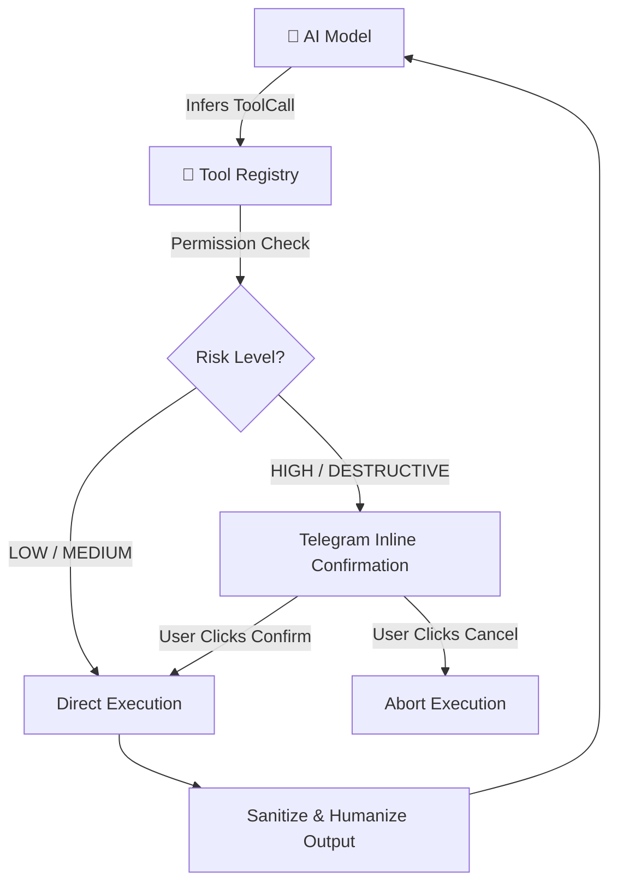

# Tool Integration & Extension Guide (v2.0)

Telegram Agent Platform features an extensible tool registry with granular permission tiers, SSRF protection, path jailement, and interactive confirmation gates for high-risk actions.

---

## Built-in & Extended Tool Suite



### 1. Web Search (`web_search`)
* **Purpose**: Fetches real-time public web information without API keys via DuckDuckGo HTML scraping.
* **Security**: Automatically strips raw HTML tags and wraps snippets in untrusted prompt delimiters to mitigate prompt injection.
* **Permission**: `READ` | **Risk**: `LOW`
* **Schema**:
  ```json
  {
    "name": "web_search",
    "description": "Search the web for current information and facts.",
    "parameters": {
      "type": "object",
      "properties": {
        "query": { "type": "string", "description": "Search query keywords" },
        "max_results": { "type": "integer", "description": "Number of results (1-5)", "default": 3 }
      },
      "required": ["query"]
    }
  }
  ```

### 2. Python Sandbox (`python_sandbox`)
* **Purpose**: Runs computational scripts, data analysis, or algorithmic verification in an isolated process.
* **Security**:
  * Strict execution timeout (default 15 seconds).
  * Restricted standard library and process isolation.
  * Standard output (`stdout`) and error (`stderr`) capture.
* **Permission**: `EXECUTE` | **Risk**: `MEDIUM`
* **Schema**:
  ```json
  {
    "name": "python_sandbox",
    "description": "Execute a Python script in an isolated runtime environment.",
    "parameters": {
      "type": "object",
      "properties": {
        "code": { "type": "string", "description": "Python code snippet to execute" }
      },
      "required": ["code"]
    }
  }
  ```

### 3. HTTP Fetcher (`http_fetch`)
* **Purpose**: Fetches web page content, documentation, or public API endpoints.
* **Security**:
  * **SSRF Guard**: Pre-resolves IP addresses and drops any connection targeting private subnets (`10.0.0.0/8`, `172.16.0.0/12`, `192.168.0.0/16`, `127.0.0.1`) or cloud metadata endpoints (`169.254.169.254`).
  * Enforces maximum response body size limits (default 1MB).
  * Converts HTML bodies to clean Markdown text.
* **Permission**: `READ` | **Risk**: `LOW`
* **Schema**:
  ```json
  {
    "name": "http_fetch",
    "description": "Fetch content from a public URL via HTTP GET with SSRF protection.",
    "parameters": {
      "type": "object",
      "properties": {
        "url": { "type": "string", "description": "Fully qualified HTTP/HTTPS URL" },
        "headers": { "type": "object", "description": "Optional HTTP request headers" }
      },
      "required": ["url"]
    }
  }
  ```

### 4. Weather API (`weather`)
* **Purpose**: Retrieves current atmospheric conditions and multi-day meteorological forecasts.
* **Security**: Validates geographic coordinates and city names before dispatch.
* **Permission**: `READ` | **Risk**: `LOW`
* **Schema**:
  ```json
  {
    "name": "weather",
    "description": "Get current weather conditions or multi-day forecasts for a location.",
    "parameters": {
      "type": "object",
      "properties": {
        "location": { "type": "string", "description": "City name or coordinates (e.g. 'Jakarta' or '-6.2,106.8')" },
        "forecast_days": { "type": "integer", "description": "Number of forecast days (1-7)", "default": 1 }
      },
      "required": ["location"]
    }
  }
  ```

### 5. Chart Generator (`generate_chart`)
* **Purpose**: Generates visual diagrams and plots (line, bar, pie, scatter) and dispatches them directly to the Telegram chat as native photo messages.
* **Security**: Generates images in-memory or in isolated temporary buffers with immediate garbage collection.
* **Permission**: `WRITE` | **Risk**: `LOW`
* **Schema**:
  ```json
  {
    "name": "generate_chart",
    "description": "Generate visual charts (line, bar, pie, scatter) and send as image.",
    "parameters": {
      "type": "object",
      "properties": {
        "chart_type": { "type": "string", "enum": ["line", "bar", "pie", "scatter"], "description": "Chart visual type" },
        "title": { "type": "string", "description": "Title of the chart" },
        "data": { "type": "object", "description": "Key-value or X-Y series data points" }
      },
      "required": ["chart_type", "title", "data"]
    }
  }
  ```

### 6. Filesystem Manager (`file_read`, `file_write`, `list_directory`)
* **Purpose**: Reads, writes, and lists files within the configured workspace.
* **Security**:
  * Jailed strictly to `FILESYSTEM_ROOT_DIR` (default `./data`).
  * Enforces `os.path.commonpath` verification to prevent `../` directory traversal.
  * Read-only mode can be enforced via `FILESYSTEM_READ_ONLY=true`.
* **Permission**: `READ` / `WRITE` | **Risk**: `LOW` / `MEDIUM`

### 7. GitHub Integration (`github`)
* **Purpose**: Inspects repositories, tracks issues, reads pull requests, and views recent commit logs.
* **Security**: Authenticated via personal access token (`GITHUB_TOKEN`). Write actions (e.g. creating issues) require `GITHUB_ALLOW_WRITE=true`.
* **Permission**: `READ` / `WRITE` | **Risk**: `LOW`

### 8. Shell Executor (`shell_execute`)
* **Purpose**: Runs terminal commands on the host environment when explicitly enabled.
* **Security**:
  * Disabled by default (`ALLOW_SHELL=false`).
  * Hardcoded blacklist for destructive commands (`rm -rf /`, `mkfs`, `dd`, `shutdown`, `reboot`, fork bombs).
  * **Requires interactive user confirmation** in Telegram before execution starts.
* **Permission**: `EXECUTE` | **Risk**: `HIGH`

---

## Tool Permission & Risk Matrix

| Tool | Permission Level | Risk Tier | Auto-Execute | Confirmation Gate |
| :--- | :--- | :--- | :---: | :---: |
| `web_search` | `READ` | `LOW` | ✅ Yes | ❌ No |
| `weather` | `READ` | `LOW` | ✅ Yes | ❌ No |
| `http_fetch` | `READ` | `LOW` | ✅ Yes | ❌ No |
| `generate_chart` | `WRITE` | `LOW` | ✅ Yes | ❌ No |
| `file_read` | `READ` | `LOW` | ✅ Yes | ❌ No |
| `list_directory` | `READ` | `LOW` | ✅ Yes | ❌ No |
| `github` (read) | `READ` | `LOW` | ✅ Yes | ❌ No |
| `python_sandbox` | `EXECUTE` | `MEDIUM` | ✅ Yes | ❌ No |
| `file_write` | `WRITE` | `MEDIUM` | ✅ Yes | ❌ No |
| `github` (write) | `WRITE` | `MEDIUM` | ✅ Yes | ❌ No |
| `shell_execute` | `EXECUTE` | `HIGH` | ❌ No | ✅ **Required** |

---

## Implementing a Custom Tool

To add a new tool to the agent runtime:

### 1. Inherit from `BaseTool`
Create a new file under `src/infrastructure/tools/`:

```python
from typing import Any, Dict
from src.domain.tool import BaseTool, ToolDefinition, PermissionLevel, RiskLevel, ToolExecutionResult

class CustomCalculatorTool(BaseTool):
    """Custom mathematical computation tool."""

    @property
    def definition(self) -> ToolDefinition:
        return ToolDefinition(
            name="calculate",
            description="Evaluate complex mathematical expressions.",
            parameters={
                "type": "object",
                "properties": {
                    "expression": {"type": "string", "description": "Mathematical expression, e.g. 'sqrt(144) + 12'"}
                },
                "required": ["expression"]
            },
            permission=PermissionLevel.EXECUTE,
            risk_level=RiskLevel.LOW
        )

    async def execute(self, arguments: Dict[str, Any], user_id: int) -> ToolExecutionResult:
        expression = arguments.get("expression", "")
        try:
            # Safe evaluation logic here
            result = str(eval(expression, {"__builtins__": {}}, {}))
            return ToolExecutionResult(content=f"Result: {result}", is_error=False)
        except Exception as e:
            return ToolExecutionResult(content=f"Math Error: {str(e)}", is_error=True)
```

### 2. Register with `ToolRegistry`
In `src/infrastructure/tools/registry.py`:

```python
registry.register(CustomCalculatorTool())
```
The tool will automatically be advertised to the AI model in all subsequent completion requests.

